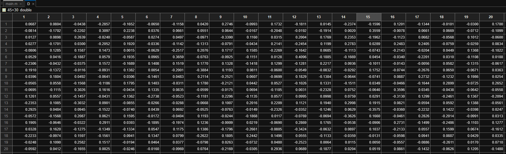
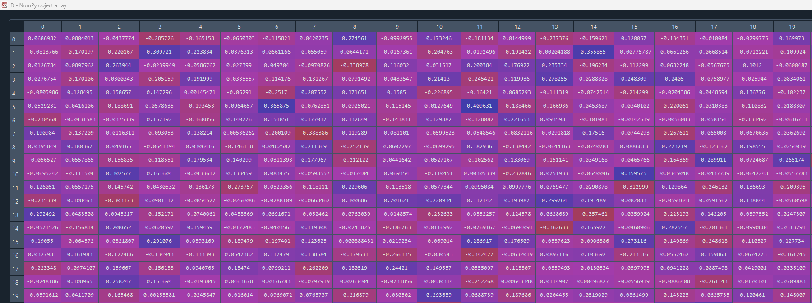

# Disaggregating input-output models with incomplete information

Implementation of [Lindner et al. (2012)](https://www.tandfonline.com/doi/suppl/10.1080/09535314.2012.689954) in Python with NumPy and Pandas.

> Lindner, Sören, Julien Legault, and Dabo Guan. 2012. ‘Disaggregating Input–Output Models with Incomplete Information’. Economic Systems Research 24 (4): 329–47. https://doi.org/10.1080/09535314.2012.689954.

The comments in `main.py` originate from [`cesr_a_689954_sup_27358897.docx`](https://www.tandfonline.com/doi/suppl/10.1080/09535314.2012.689954).

The script contains one aspect of randomness: `base(p,:) = rand(1,Nv)` in the original Matlab script and `base[p, :] = np.random.rand(1, Nv)` in the Python script.

For verification purposes, e.g. `np.random.seed(1337)` (Python) and `rand('twister', 1337)` (Matlab) can be inserted to render the random numbers predictable.

## Verification
The content of `D`.
### Matlab

### Python
